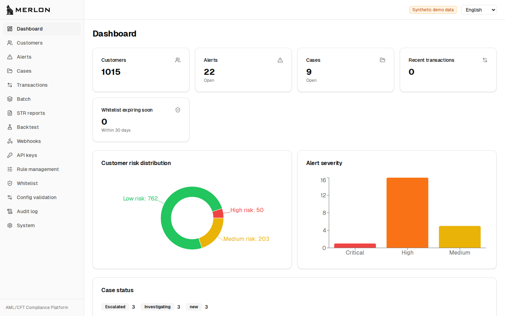
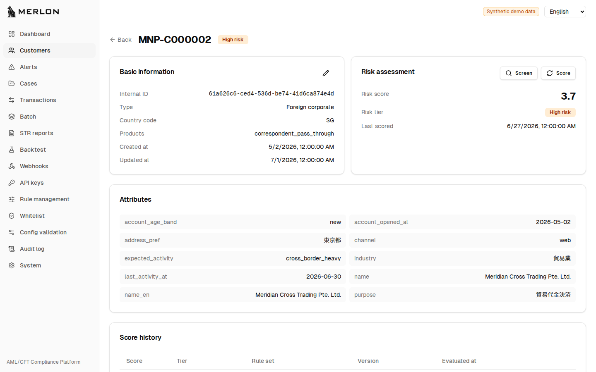

# Merlon

AML/CFT (Anti-Money Laundering / Countering the Financing of Terrorism) compliance software for Japanese non-bank financial institutions.

Merlon provides integrated **Customer Due Diligence (CDD) scoring** and **Transaction Monitoring (TM)** capabilities, designed for self-hosted deployment by crypto-asset exchanges, money transfer operators, and other regulated entities.

It is designed primarily for Japanese non-bank financial institutions, while its configuration-driven model can support banks and organizations in other jurisdictions after their own legal and compliance assessment. Each deployment serves one institution; Merlon is not a multi-tenant service.

## License

Merlon is **source-available** software licensed under the [Business Source License 1.1](LICENSE). It is **not** OSI-approved open source.

- Core software: BSL 1.1
- Sample content (`content/_sample/`): Apache-2.0

Production use is permitted under the Additional Use Grant; offering Merlon to third parties as a hosted, managed, or embedded service is not. See [LICENSE](LICENSE) for the exact terms.

GitHub labels this repository's license as "Other" because BSL 1.1 is not in its OSI-approved set — this is expected, not a misconfiguration. See [docs/decisions/0003-bsl-license-choice.md](docs/decisions/0003-bsl-license-choice.md) for the rationale.

## Architecture

```
┌─────────────────────────────────────────────────┐
│  External Systems (customer's existing infra)   │
└───────────────────────┬─────────────────────────┘
                        │ REST / Webhook
┌───────────────────────▼─────────────────────────┐
│  api/ (Go)                                      │
│  Customer, Transaction, Case, Report Services   │
│  REST API + native scoring/TM/screening engine  │
└───────────────────────┬─────────────────────────┘
                        │
┌───────────────────────▼─────────────────────────┐
│  Data Layer                                     │
│  PostgreSQL (primary) / Redis (cache, optional) │
└─────────────────────────────────────────────────┘
        ▲
┌───────┴─────────────────────────────────────────┐
│  ui/ (TypeScript + React)                       │
│  Operator Dashboard                             │
└─────────────────────────────────────────────────┘
```

See [docs/architecture.md](docs/architecture.md) for details.

## Quick Start

Prerequisites: [Docker](https://docs.docker.com/get-docker/) and [Docker Compose](https://docs.docker.com/compose/install/)

```bash
git clone https://github.com/ksuk/merlon.git
cd merlon
cp .env.example .env
docker compose up --build
```

Then open **[http://localhost:8080](http://localhost:8080)**. Authentication is
on, and no account exists yet, so follow **Create the administrator account**
on the login screen to create the first one, then log in with it.

The `.env` you copied contains development-only credentials. Replace them
before this reaches anything but your own machine — see
[docs/configuration.md](docs/configuration.md).

See [docs/getting-started.md](docs/getting-started.md) for the full guide, and
[docs/troubleshooting/index.md](docs/troubleshooting/index.md) if something
does not come up.

## Demo

Want to try Merlon without your own data? A local demo stack ships with a
synthetic dataset (about 1,015 customers, 98 alerts) and authentication
disabled, so you can click through scoring, alerts, cases, and reports
immediately.

```bash
docker compose -f docker-compose.demo.yml up --build
```

Open [http://127.0.0.1:8080](http://127.0.0.1:8080). Follow
[docs/demo-tour.md](docs/demo-tour.md) for a guided walkthrough of both a
compliance-reviewer path and a technical-evaluator path.



The dashboard opens on the portfolio: how customers fall across risk tiers, and
how open alerts fall across severities.



Every customer shows the CDD score and tier it was assigned, the attributes the
score was derived from, and the history of previous scorings.

This dataset is entirely synthetic — never load real customer or transaction
data into it, and never run this compose file on a publicly reachable host;
it has no authentication.

Prefer not to use Docker? See "Running without Docker" in
[docs/demo-tour.md](docs/demo-tour.md#running-without-docker) for the
in-memory equivalent.

## Development

Requirements: Go 1.26+, Node.js 26+

```bash
# Run all tests
make test

# Build all components
make build

# Start development environment
make dev-up
```

See [docs/development/setup.md](docs/development/setup.md) for detailed setup instructions. Alternatively, use the [Dev Container](.devcontainer/) for a pre-configured environment.

## Documentation

| Document | Description |
|---|---|
| [Getting Started](docs/getting-started.md) | Installation and first run |
| [FAQ](docs/faq.md) | What Merlon is, and why it is built this way |
| [Architecture](docs/architecture.md) | System design overview |
| [Configuration](docs/configuration.md) | All configuration options |
| [Container Images](docs/operations/container-images.md) | What is published, and what each tag means |
| [Upgrading](docs/operations/upgrade.md) | Verify, migrate, roll back |
| [Backup and Restore](docs/operations/backup-restore.md) | Database **and** encryption key ring |
| [Troubleshooting](docs/troubleshooting/index.md) | Symptom index for actual error messages |
| [Security and Assurance](docs/security/index.md) | Data egress, supply chain, accepted risks |
| [FSA Guideline Mapping](docs/compliance/fsa-guideline-mapping.md) | Regulatory compliance coverage |
| [Development Setup](docs/development/setup.md) | Local development environment |
| [ADRs](docs/decisions/) | Architecture decision records |

## Getting Help

- Questions and usage help: [GitHub Discussions](https://github.com/ksuk/merlon/discussions).
- Bugs and feature requests: open a GitHub issue using one of the templates.
- Security vulnerabilities: use private reporting as described in [SECURITY.md](SECURITY.md). Never open a public issue for one.
- Contributing: [CONTRIBUTING.md](CONTRIBUTING.md) — commits require a DCO sign-off.
- Community expectations: [CODE_OF_CONDUCT.md](CODE_OF_CONDUCT.md).

## Status

This project is in active development. It publishes one release channel,
`vX.Y.Z`, built with a provenance attestation, a CycloneDX SBOM, and an
immutable digest.

It has one active maintainer, so the independent approval a release tag is
often assumed to carry cannot exist here. Rather than work around that, every
release states it: `release-manifest.json` and the image labels record
`independent_approval: false` and `separation_of_duties: false`, and the release
notes say so above the changelog. Merges require a self-review record enforced
by a status check, not an approval nobody can give. See
[ADR-0016](docs/decisions/0016-single-maintainer-change-control.md) and the
[release checklist](docs/development/release-checklist.md).

Core backend services (Go API with native rule evaluation), the operator
dashboard, and the release provenance pipeline are implemented. See
[CHANGELOG.md](CHANGELOG.md).

## Production Warning

**This software is intended for AML/CFT compliance operations.** Production use requires:

- Proper rule configuration and validation for your specific regulatory requirements
- Legal and compliance review by qualified professionals
- Thorough testing with your organization's data and workflows
- Ongoing maintenance and regulatory updates

The developers of this software are not responsible for regulatory compliance decisions made using this tool.
