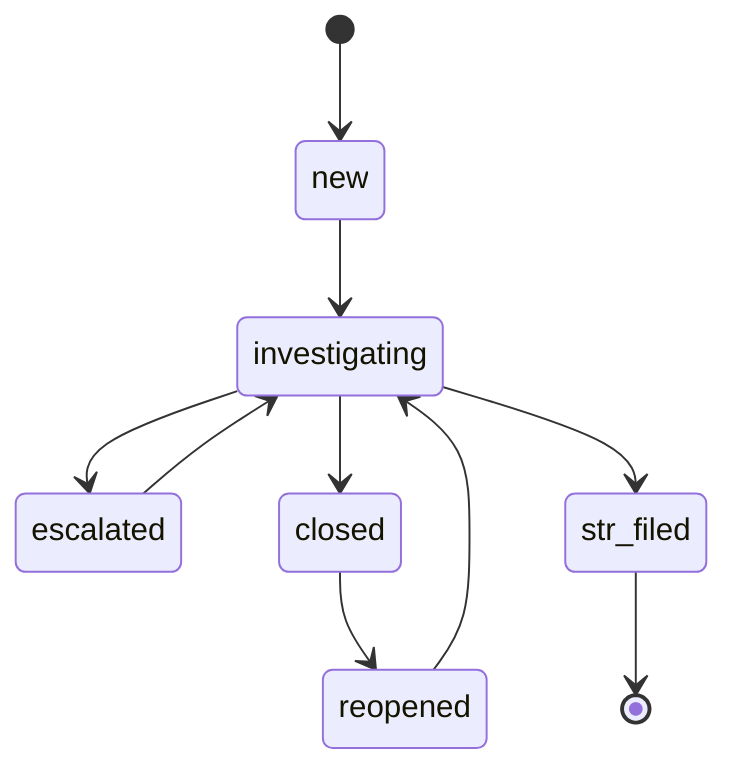

# Case Management Workflow

Cases organize alerts for a customer. The legacy `open` status is accepted as
an alias of `new` for compatibility. A case uses the following transitions:

`str_filed` is terminal. A subsequent alert creates a separate related case
instead of reopening the filed case. Reopening requires an Analyst or Admin
and a reason. Case updates support optimistic locking through `updated_at`.

Case/alert links preserve historical evidence while preventing contradictory
new work:

| Case state | Linked alert state allowed in stored history | New alert attachment |
|---|---|---|
| `open`, `new`, `investigating`, `escalated`, `reopened` | Active or terminal | Active alerts only |
| `closed`, `str_filed` | Terminal only | Not allowed |

An attachment is rejected unless the case and alert are both active, the alert
exists, and both records belong to the same customer. Creating a linked case
and appending links are atomic operations. A terminal alert may remain as
history when its closed case is reopened, but it is not reactivated.
An alert that needs renewed review can be explicitly reopened to `investigating`
only with a non-empty rationale and confirmation; its terminal decision remains
in the append-only decision history and is linked to the reopening event.

## EDD escalation

For High-tier customers with an open EDD request, the scheduled job applies
these recommendations:

| Elapsed time | Action |
|---|---|
| 30 days | Re-send the EDD-required notification, at most once per calendar day. |
| 60 days by default | Emit a transaction-restriction recommendation and ensure a High-priority EDD case exists. |
| 90 days by default | Emit a relationship-decline recommendation and raise the EDD case to Critical. |

The 60- and 90-day intervals are configurable. Merlon only detects elapsed
time and emits recommendations; the deploying organization remains responsible
for restriction or relationship decisions and their execution.

## Bulk alert operations

`POST /api/v1/alerts/bulk-close` closes matching active alerts (`open`,
`investigating`, or `escalated`) as false positives and requires a reason. It
can filter by scenario, period, and severity. This dedicated reviewed-bulk
operation may close an `open` alert directly; ordinary single-alert state
transitions still require `open` to advance through `investigating`.
`POST /api/v1/alerts/bulk-case` assigns selected alerts to an existing case or
creates a new case for a supplied customer. Both operations write one audit
entry per affected alert to preserve traceability.

## Wave 2 investigation workflow

Alerts and cases expose durable queue fields for assignment, team, priority,
disposition, due date, and age. Queue filters are composable and include
customer, status, assignee or team, unassigned, severity or priority,
scenario, disposition, STR candidacy, free-text search, overdue, and age
range. The `mine=true` filter resolves to the authenticated operator. The
operator directory endpoint provides valid assignment choices when
authentication is configured.

Queue pagination has one deterministic order: risk rank descending
(`critical` > `high` > `medium` > `low`), then `updated_at` descending, then
the canonical ID descending. A queue cursor carries a fingerprint of every
filter; reusing it with a different filter is rejected instead of silently
skipping or repeating rows. The cursor contract is stable for the dataset
visible when traversal starts: inserts or updates that occur during traversal
are not promised to appear in that traversal, and the API does not claim a
cross-request database snapshot. The compatibility `offset` branch is
deprecated and returns `Deprecation` and `Sunset` headers. Unfiltered legacy
customer/case/alert listings retain their documented created-at ordering;
queue consumers should use the filtered queue contract (or `sort=risk`) when
they need risk-ranked work.

Case investigation is append-only. Case events record the changed field,
before/after values, reason, actor, timestamp, related entity IDs, and a
correlation ID. Evidence, checklist items, work items, and related-case
relationships have their own durable records; corrections and removals add a
new event and retain the prior history. The case-file export is versioned
(`case-file-v1`) and includes stable event ordering and references.
`GET /api/v1/cases/{id}/timeline` accepts `event_type`/`event_types` filters
and cursor pagination (`limit` plus `cursor`); filtered pages return
`event_pagination`. The legacy `offset` parameter remains available during
the compatibility window and is marked deprecated with `Deprecation` and
`Sunset` response headers.
Evidence corrections use `POST /cases/{id}/evidence/{evidence}/corrections`
with a required reason; the API appends a new version and an
`evidence_corrected` event, leaving the original evidence row untouched.

Automatic related cases are a read-only same-customer view. A manual related-case
relationship is directed from the case where it was created to the selected case;
the API and UI expose that direction, relationship type, rationale, creator, and
history. Manual links require both cases to belong to the same customer and both
to be active when the link is created. Removing or correcting a link never
deletes its prior record.

STR candidacy is an investigation disposition on an active case and is
separate from the terminal filed state. STR reports are durable drafts with an explicit draft-to-submitted transition.
Submission records the submitted timestamp, channel, destination, external
reference, and evidence. Submitted reports are immutable; corrections or
amendments must be represented as a new report/version rather than silently
overwriting the submitted report. A filed case remains terminal; a correction,
withdrawal, or resubmission is a new explicitly linked report and follow-up
case under the configured filing process, never a silent reopen. CSV and JSON
exports use the same report identity and snapshot data, and report export
errors are returned explicitly. The legacy `alert_id` export form remains
available during the compatibility window and is marked with `Deprecation`,
`Sunset`, and a successor link; new integrations should use `report_id`.
