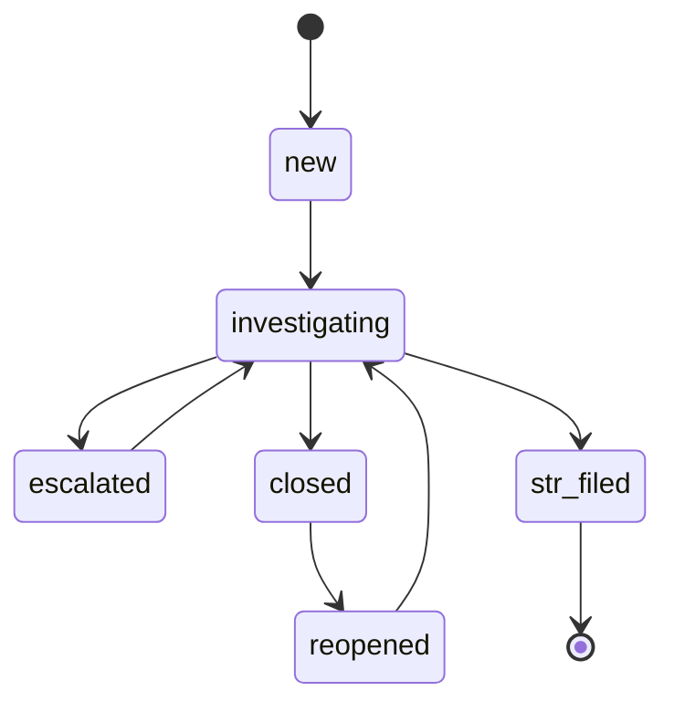

# Case Management Workflow

Cases organize alerts for a customer. The legacy `open` status is accepted as
an alias of `new` for compatibility. A case uses the following transitions:

`str_filed` is terminal. A subsequent alert creates a separate related case
instead of reopening the filed case. Reopening requires an Analyst or Admin
and a reason. Case updates support optimistic locking through `updated_at`.

## EDD escalation

For High-tier customers with an open EDD request, the scheduled job applies
these recommendations:

| Elapsed time | Action |
|---|---|
| 30 days | Re-send the EDD-required notification, at most once per calendar day. |
| 60 days by default | Emit a transaction-restriction recommendation and ensure a High-priority EDD case exists. |
| 90 days by default | Emit a relationship-decline recommendation and raise the EDD case to Critical. |

The 60- and 90-day intervals are configurable. Merlon only detects elapsed
time and emits recommendations; the deploying organization remains responsible
for restriction or relationship decisions and their execution.

## Bulk alert operations

`POST /api/v1/alerts/bulk-close` closes matching open alerts as false positives
and requires a reason. It can filter by scenario, period, and severity.
`POST /api/v1/alerts/bulk-case` assigns selected alerts to an existing case or
creates a new case for a supplied customer. Both operations write one audit
entry per affected alert to preserve traceability.
