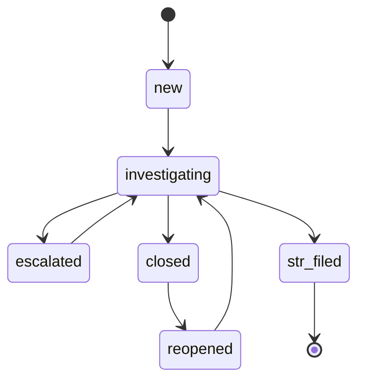

# ケース管理ワークフロー

ケースは顧客ごとにアラートを整理する。互換性のため、レガシーの `open` ステータスは `new` の別名として受け付けられる。ケースは以下の遷移を持つ。

`str_filed` は終端状態である。以降のアラートは、届出済みのケースを再オープンするのではなく、別の関連ケースを作成する。再オープンには Analyst または Admin 権限と理由が必要となる。ケースの更新は `updated_at` による楽観的ロックをサポートする。

## EDD エスカレーション

未完了の EDD リクエストを持つ High ティア顧客に対して、スケジュールジョブは以下の推奨アクションを適用する。

| 経過時間 | アクション |
|---|---|
| 30日 | EDD 必須通知を再送する（暦日で1日1回まで）。 |
| デフォルトで60日 | 取引制限の推奨を発行し、High 優先度の EDD ケースが存在することを保証する。 |
| デフォルトで90日 | 関係解消の推奨を発行し、EDD ケースを Critical に引き上げる。 |

60日・90日の間隔は設定可能である。Merlon は経過時間を検知して推奨事項を発行するのみであり、制限措置や関係に関する判断・実行の責任は導入組織が負う。

## アラートの一括操作

`POST /api/v1/alerts/bulk-close` は、条件に一致する未対応アラートを誤検知として一括クローズし、理由の入力を必須とする。シナリオ・期間・重大度でフィルタ可能である。`POST /api/v1/alerts/bulk-case` は、選択したアラートを既存のケースに割り当てるか、指定した顧客に対して新規ケースを作成する。両操作とも、追跡可能性を保つため、対象アラートごとに1件の監査エントリを記録する。
