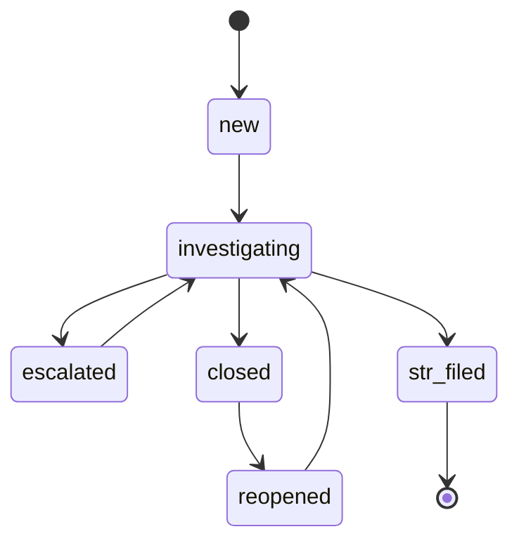

# ケース管理ワークフロー

ケースは顧客ごとにアラートを整理する。互換性のため、レガシーの `open` ステータスは `new` の別名として受け付けられる。ケースは以下の遷移を持つ。

`str_filed` は終端状態である。以降のアラートは、届出済みのケースを再オープンするのではなく、別の関連ケースを作成する。再オープンには Analyst または Admin 権限と理由が必要となる。ケースの更新は `updated_at` による楽観的ロックをサポートする。

ケースとアラートのリンクは、矛盾する新規作業を防ぎながら、過去の証跡を保持する。

| ケース状態 | 保存済み履歴として許可されるアラート状態 | 新規アラートの追加 |
|---|---|---|
| `open`、`new`、`investigating`、`escalated`、`reopened` | 対応中または終端 | 対応中アラートのみ |
| `closed`、`str_filed` | 終端のみ | 不可 |

アラートの追加は、ケースとアラートがともに対応中であり、アラートが存在し、両レコードが同一顧客に属する場合に限り許可される。リンク付きケースの作成とリンクの追加は原子的に行われる。終端アラートは、クローズ済みケースの再オープン後も履歴として保持できるが、再び対応中には戻さない。再確認が必要なアラートは、空でない理由と確認を明示した場合に限り `investigating` へ明示的に再オープンできる。終端時の判定は追記専用の判定履歴に残り、再オープンイベントから参照できる。

## EDD エスカレーション

未完了の EDD リクエストを持つ High ティア顧客に対して、スケジュールジョブは以下の推奨アクションを適用する。

| 経過時間 | アクション |
|---|---|
| 30日 | EDD 必須通知を再送する（暦日で1日1回まで）。 |
| デフォルトで60日 | 取引制限の推奨を発行し、High 優先度の EDD ケースが存在することを保証する。 |
| デフォルトで90日 | 関係解消の推奨を発行し、EDD ケースを Critical に引き上げる。 |

60日・90日の間隔は設定可能である。Merlon は経過時間を検知して推奨事項を発行するのみであり、制限措置や関係に関する判断・実行の責任は導入組織が負う。

## アラートの一括操作

`POST /api/v1/alerts/bulk-close` は、条件に一致する対応中アラート（`open`、`investigating`、`escalated`）を誤検知として一括クローズし、理由の入力を必須とする。シナリオ・期間・重大度でフィルタ可能である。このレビュー済み一括操作では `open` アラートを直接クローズできるが、通常の単一アラート状態遷移では引き続き `open` から `investigating` を経由する必要がある。`POST /api/v1/alerts/bulk-case` は、選択したアラートを既存のケースに割り当てるか、指定した顧客に対して新規ケースを作成する。両操作とも、追跡可能性を保つため、対象アラートごとに1件の監査エントリを記録する。

## Wave 2 調査ワークフロー

アラートとケースは、担当者、チーム、優先度、処分、期限、経過日数を永続化する。キューのフィルタは組み合わせて利用でき、顧客、状態、担当者またはチーム、未割当、重大度または優先度、シナリオ、処分、STR 候補、全文検索、期限超過、経過日数範囲に対応する。`mine=true` は認証済みオペレーターに解決される。認証が有効な場合、オペレーター一覧 API が割当先の候補を提供する。

キューのページング順序は、リスク順位の降順（`critical`、`high`、`medium`、`low`）、`updated_at` の降順、正規化した ID の降順で固定する。キューカーソルには全フィルタのフィンガープリントを保持し、別のフィルタで再利用した場合は、行の欠落や重複を隠さず拒否する。このカーソルが保証するのは走査開始時点で見えていたデータセットに対する安定した順序であり、走査中に追加・更新された行が同じ走査へ現れることや、リクエストをまたぐデータベースの完全なスナップショットは保証しない。互換用の `offset` 分岐は非推奨であり、`Deprecation` と `Sunset` ヘッダーを返す。フィルタなしのレガシーな顧客・ケース・アラート一覧は既存の作成時刻順を維持するため、リスク順位のキューにはフィルタ付きキュー契約（または `sort=risk`）を利用する。

ケース調査は追記専用である。ケースイベントには変更項目、変更前後の値、理由、実行者、時刻、関連エンティティ ID、相関 ID を記録する。証拠、チェックリスト、作業項目、関連ケースはそれぞれ永続化され、訂正や削除は新しいイベントとして記録し、過去の履歴を保持する。ケースファイル出力はバージョン（`case-file-v1`）を持ち、イベントの安定した順序と参照を含む。

自動関連ケースは、同一顧客の履歴を表示する読み取り専用のビューである。手動の関連ケースは、作成元ケースから選択先ケースへの一方向リンクとして扱い、API と UI で方向、関連種別、理由、作成者、履歴を表示する。新規手動リンクは同一顧客かつ双方が対応中の場合に限る。削除・訂正しても過去のレコードは削除しない。

STR 候補は対応中ケースの調査処分であり、終端状態の届出済みとは別の概念である。STR は永続化されたドラフトであり、ドラフトから提出済みへの遷移は明示的に実行する。提出時には提出日時、チャネル、宛先、外部参照、証跡を記録する。提出済みレポートは不変であり、訂正・変更は提出済みレポートを黙って上書きせず、新しいレポートまたはバージョンとして表現する。届出済みケースは終端状態のままとし、訂正・取下げ・再提出は、設定された届出プロセスに従う明示的にリンクされた新しいレポートとフォローアップケースで表現する。CSV と JSON は同じレポート識別子とスナップショットデータを使用し、出力エラーは明示的に返す。旧 `alert_id` 出力形式は互換期間中のみ維持し、`Deprecation`、`Sunset`、後継リンクを返す。新規連携は `report_id` を使用する。
